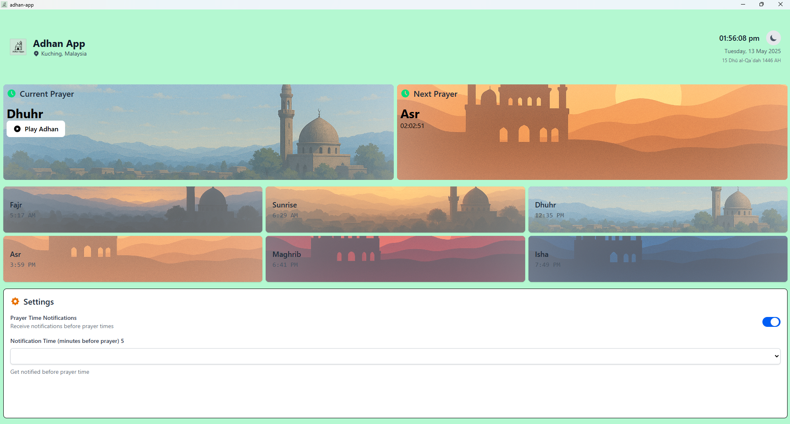
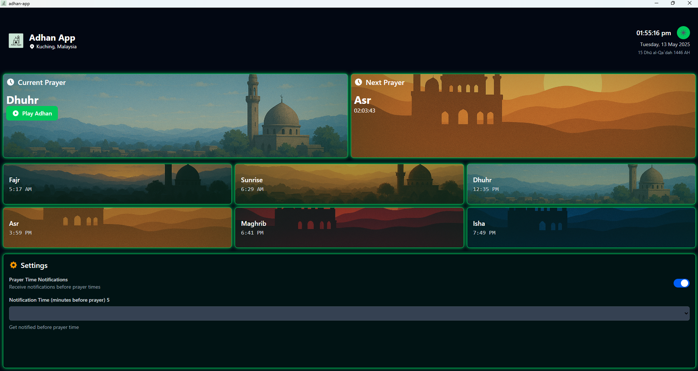

# Adhan App


A beautiful, cross-platform desktop application for Islamic prayer times, notifications, and Adhan playback built with Tauri, SvelteKit, and Tailwind CSS.

## Features

- 🕋 **Accurate Prayer Times**: Uses the Al-Adhan API with multiple calculation methods
- 🔔 **Desktop Notifications**: Get alerts before prayer times
- 🌙 **Dark/Light Mode**: Choose your preferred theme or use system settings
- 📍 **Location Detection**: Automatically detects your location for accurate times
- 📅 **Hijri Date**: Displays current Islamic date
- 🔄 **Live Countdown**: Real-time countdown to next prayer
- 🎵 **Adhan Playback**: Built-in audio for the call to prayer
- 💾 **Persistent Settings**: Your preferences are saved between sessions

## Screenshots

<div align="center">
  
  
</div>

## Installation

### Download Pre-built Binaries

Download the latest version for your operating system from the [Releases](https://github.com/yourusername/adhan-app/releases) page.

### Build from Source

#### Prerequisites

- Node.js (v16+)
- Rust (latest stable)
- Tauri CLI (`npm install -g @tauri-apps/cli`)

#### Steps

1. Clone the repository:
   ```bash
   git clone https://github.com/yourusername/adhan-app.git
   cd adhan-app
   ```

2. Install dependencies:
   ```bash
   npm install
   ```

3. Add the Tauri notification plugin:
   ```bash
   npm run tauri add notification
   ```

4. Build the application:
   ```bash
   npm run tauri build
   ```

5. Find the built application in the `src-tauri/target/release` directory

## Development

1. Clone the repository as above

2. Install dependencies:
   ```bash
   npm install
   ```

3. Add the Tauri notification plugin:
   ```bash
   npm run tauri add notification
   ```

4. Start the development server:
   ```bash
   npm run tauri dev
   ```

<!-- ## Project Structure

```
adhan-app/
├── src/
│   ├── routes/
│   │   └── +page.svelte  # Main app component
│   └── app.html          # Base HTML template
├── src-tauri/
│   ├── src/              # Rust code for Tauri
│   ├── Cargo.toml        # Rust dependencies
│   └── tauri.conf.json   # Tauri configuration
├── static/
│   ├── audio/            # Adhan audio files 
│   └── images/           # App images and icons
├── package.json          # Node dependencies
└── README.md             # Project documentation
``` -->

## Configuration

### Tauri Configuration

Ensure your `tauri.conf.json` has the following permissions:

```json
"plugins": {
  "notification": {
    "all": true
  }
},
"allowlist": {
  "window": {
    "all": true,
    "setFocus": true
  }
}
```

### Customizing Prayer Calculation Methods

The app supports various calculation methods for prayer times:

- Muslim World League
- Islamic Society of North America (ISNA)
- Egyptian General Authority of Survey
- Umm al-Qura University, Makkah
- University of Islamic Sciences, Karachi
- And others

## API Usage

This application uses the [Al-Adhan API](https://aladhan.com/prayer-times-api) for retrieving prayer times and the [OpenStreetMap Nominatim API](https://nominatim.org/) for geocoding.


## License

This project is licensed under the MIT License - see the [LICENSE](LICENSE) file for details.

## Acknowledgments

- [Tauri](https://tauri.app/) for the framework
- [SvelteKit](https://kit.svelte.dev/) for the frontend
- [Tailwind CSS](https://tailwindcss.com/) for styling
- [Al-Adhan API](https://aladhan.com/prayer-times-api) for prayer times data
- [OpenStreetMap Nominatim](https://nominatim.org/) for geocoding

## Contact


Project Link: [https://github.com/Cjul96/adhan-app](https://github.com/Cjul96/adhan-app)